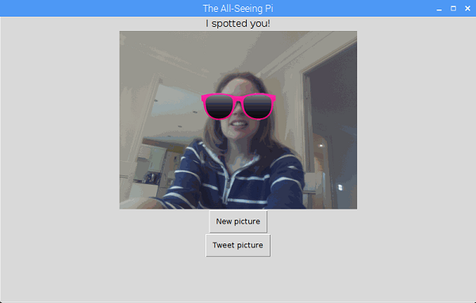
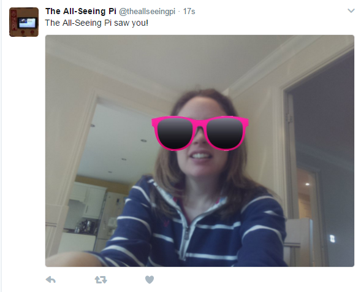

## Tweet picture

If you just want a fun photo booth to take and save pictures, you could stop there. Alternatively, you could go one step further and make your All-Seeing Pi tweet the photo that was taken.

- You will need to set up a Twitter account and create an app for your All-Seeing Pi. Follow steps 1-4 on the [Getting started with the Twitter API](https://projects.raspberrypi.org/en/projects/getting-started-with-the-twitter-api/worksheet/) resource in a separate file, and check that you can successfully send a textual tweet from Python.

- Save a copy of the `auth.py` file containing your Twitter API keys (which you created during the 'Getting started' tutorial) inside your `/home/pi/allseeingpi` folder.

- Go back to your `allseeingpi.py` file and, after the other import statements, import Twython:

    ```python
    from twython import Twython
    ```

- Immediately after importing Twython, add the following code to import your Twitter API credentials from your `auth.py` file:

    ```python
    from auth import (
        consumer_key,
        consumer_secret,
        access_token,
        access_token_secret
    )
    ```

- Create a new function after the `new_picture()` function, called `send_tweet()`:

    ```python
    def send_tweet():
    ```

- Inside the function, instantiate a Twitter object:

    ```python
    def send_tweet():
        twitter = Twython(
        consumer_key,
        consumer_secret,
        access_token,
        access_token_secret
        )
    ```

- Add some more code inside the `send_tweet()` function to tweet the `output` picture. You can change the text in your `message` code if you want your tweet to say something different:

    ```python
    message = "The All-Seeing Pi saw you!"
    with open(output, 'rb') as photo:
        twitter.update_status_with_media(status=message, media=photo)
    ```

- Now, find the code for the GUI where you create the `PushButton` for a new picture, and add another `PushButton` underneath it which will call the `send_tweet()` function when it is pressed:

    ```python
    tweet_pic = PushButton(app, send_tweet, text="Tweet picture")
    ```

    

- Save and run your program. Test whether, when you take a picture and press the **Tweet picture** button on the GUI, the picture is tweeted from your Twitter account.

    


The finished code is [here](resources/finished_allseeingpi.py): you can check it against your code if you need to.

Once you are happy that your All-Seeing Pi works, you may wish to remove the `alpha=128` command from the camera preview to make it fully opaque. You can also make the GUI full-screen: locate the line `app = App("The All-Seeing Pi", 800, 480)` and, immediately after it, add the line `app.attributes("-fullscreen", True)`.

